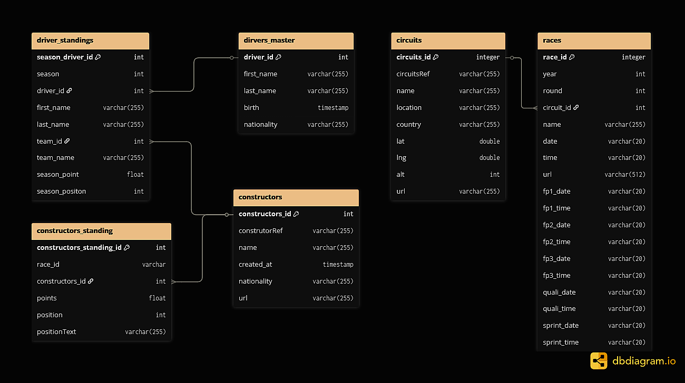

<h1 align='center' style='font-weight: bold;'> 🏎️ F1 Dashboard </h1>

>**목차**
>
> 1. [팀 소개](#-팀-소개)
> 2. [프로젝트 개요](#-프로젝트-개요)
> 3. [기술 스택](#️-기술-스택)
> 4. [WBS](#-wbs)
> 5. [사용 메뉴얼](#-사용-메뉴얼)
> 6. [ERD](#-erd)
> 7. [주요 프로시저](#-주요-프로시저)
> 8. [수행 결과](#-수행-결과)
> 9. [회고](#-회고)
 
<!--  -->

## 👥 팀 소개
  

<h3 style='color:white; font-weight: bold;margin:auto;display:block;'> Team F4 </h3>

 

| <h class="gray_text">👑 이재일</h> | <h class="gray_text">김재원</h> | <h class="gray_text">김동민</h> | <h class="gray_text">유진영</h> |
|:-:|:-:|:-:|:-:|
|||||
|[@qufdlfkd88](https://github.com/qufdlfkd88)|[@kimjae9360](https://github.com/kimjae9360)|[@Uranium10](https://github.com/Uranium10)|[@ujneg18-source](https://github.com/ujneg18-source)|
|사용메뉴얼|FAQ|README |DB정의서 ERD 데이터 설명서|
|레이싱 일정|컨스트럭터 순위|드라이버, 팀별 통계 & 분석|드라이버 순위|

 

##  🚀 프로젝트 개요
 

>
> **F1 대쉬보드**는 **Python, Streamlit 을 활용**하여 **F1 그랑프리**(FIA Formula One World Championship) 의 **선수들과 팀 관련 정보**를 통계 정보를, **시각화하여** 제공하는 **동적 웹 페이지**입니다.
> 
 

## 🛠️ 기술 스택
 

 

 

## 📊 WBS

 
## 🧾 사용 메뉴얼

 
<a href="./산출물/사용메뉴얼.pdf">사용 메뉴얼.pdf</a>

## 📔 ERD

 
<table border="1" width ="500" height="300">
    <tr bgcolor="#343434" color="white">
        <td width="30%">테이블</td> <td>설명</td>
    </tr>
    <tr>
        <td>driver_standings</td> 
        <td>시즌별 드라이버 성적(포인트, 순위, 소속 팀)</td>
    </tr>
    <tr>
        <td>drivers_master</td> 
        <td>드라이버 기본 정보(이름, 생년월일, 국적)</td>
    </tr>
    <tr>
        <td>constructors</td> 
        <td>컨스트럭터의 기본 정보 저장</td>
    </tr>
    <tr>
        <td>constructors_standing</td> 
        <td>각 컨스트럭터별 성적(포인트, 순위) 저장</td>
    </tr>
    <tr>
        <td>circuits</td> 
        <td>서킷 위치 정보 저장</td>
    </tr>
    <tr>
        <td>race</td> 
        <td>레이스 일정 및 개최 정보 저장</td>
    </tr>
</table>

 

## ✨ 주요 프로시저

 

- **메인 페이지** &nbsp; |  &nbsp; 간략한 최신 통계와 일정 제공
- **드라이버 순위** &nbsp; |  &nbsp; Mysql DBMS를 이용하여 드라이버 통계 제공
- **컨스트럭터 순위** &nbsp; | &nbsp;Mysql을 이용해 팀별 점유율, 순위 등의 통계 제공
- **레이스 일정**&nbsp; |  &nbsp; 데이터 API를 사용하여 일정 조회 및 다음 레이스 안내
- **통계 분석** &nbsp; |  &nbsp; 각 시즌별 드라이버 / 팀의 통계 제공, 상위 성적의 연간 동향 제공
- **FAQ** &nbsp; |  &nbsp; 질의응답 제공

 

## 👑 수행 결과

[실행](Execute.bat)

<!-- 

    🏎️
    

        <h1 style='margin:0; color:white; font-size:32px;'>F1 Dashboard</h1>
    

 -->

## 💬 회고

|||
|-|-|
|이재일| *짧은 시간이었지만 기획, 분석, 설계, 개발, 산출물 작성 등 프로젝트 진행 과정이 실무와 매우 흡사해서 놀랐고 형상 관리 프로그램으로 팀원 간 소스도 받아 보고 다른 기수 프로젝트도 볼 수 있어서 매우 유익한 시간이었습니다.*   &nbsp;|
|김재원|  *프로그래밍 작업이 개인이 아닌 팀 작업으로 하는 것이 처음이어서 걱정이 되었지만 팀웍으로 이겨낼 수 있었으며 설계, 개발 등을 꺠달을 수 있는 중요한 프로젝트였습니다. 감사합니다. *   &nbsp;|
|김동민|  *Streamlit의 component객체를 통해 python, javascript, HTML 간 상호작용을 구현하며 더 유저 친화적인 UI의 개발 가능성을 엿보았고, 데이터의 수집도 당연히 중요하지만, 제대로 된 활용을 위해선 전처리가 매우 중요함을 깨달을 수 있었습니다.*   &nbsp;|
|유진영| *이번 프로젝트를 통해 파이썬 코딩, Streamlit 구현, 크롤링까지 전체 과정을 경험하며 수업 내용을 실제로 적용하고 복습할 수 있었습니다. 특히 CSV 파일과 크롤링 데이터를 합치며 데이터를 정제하는 과정이 정말 어렵다는 걸 알게 됐습니다. 데이터 간의 이름이나 형식을 일관성 있게 맞추는 전처리 디테일이 분석의 기초가 된다는 걸 배운 값진 경험이었습니다. 또한 함수를 만들 때 독스트링을 활용해서 코드 가독성을 챙기는 게, 개인적으로 멋있어 보였고 중요하다고 느꼈습니다.*   &nbsp; |

## 데이터 출처

> *https://www.formula1.com/*  
> *https://api.jolpi.ca/ergast/f1/*  

